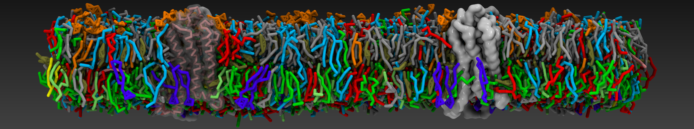

# ProLint 2.0: a scalable framework for the analysis of biomolecular interactions in MD simulations.

ProLint is a Python library for analyzing biomolecular interactions from molecular dynamics simulations. Built on MDAnalysis, it offers great efficiency in contact calculations and trajectory manipulation, proposing a simple four-step workflow: load your simulation, compute contacts between user-defined atom groups, analyze the results, and generate publication-ready plots. In addition, it provides a React-based web dashboard for interactive exploration of interaction results. You can details on how to use **prolint2** in the [documentation](https://prolint2.readthedocs.io/en/latest/index.html).



# Table of contents

- [Installation](#installation)
- [How to contribute?](#how-to-contribute)
- [License](#license)
- [Copyright](#copyright)
- [Acknowledgements](#acknowledgements)

# Installation

To install **prolint2** we recommend creating a new conda environment as follows:

```bash
   conda create -n prolint python=3.10
   conda activate prolint
```

Then you can install **prolint** via pip:

```bash
   pip install prolint
```

# How to contribute?

If you find a bug in the source code, you can help us by submitting an issue [here](https://github.com/ProLint/prolint2/issues). Even better, you can submit a Pull Request with a fix.

We really appreciate your feedback!

# License

Source code included in this project is available under the [MIT License](https://opensource.org/licenses/MIT).

# Copyright

Copyright (c) 2026, Daniel P. Ramirez-Echemendia & Besian I. Sejdiu

Acknowledgements
================
The respository structure of **ProLint2** is based on the [Computational Molecular Science Python Cookiecutter](https://github.com/molssi/cookiecutter-cms) version 1.6.
