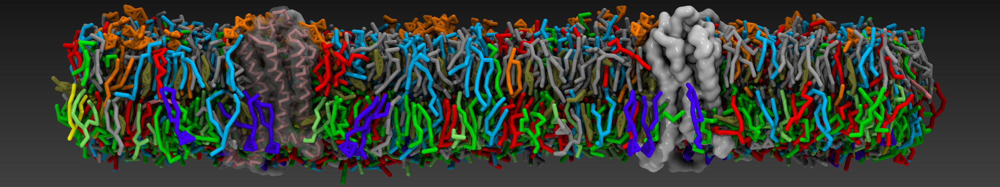

=========================================================
Welcome to the ProLint2's documentation!
=========================================================

**Last updated:** |today|

.. start-badges

|pypi|
|license|
|actions|
|codecov|
|docs|

.. |pypi| image:: https://img.shields.io/pypi/v/prolint2?color=blue
     :alt: PyPI
     :target: https://pypi.org/project/prolint2/

.. |license| image:: https://img.shields.io/badge/license-MIT-blue.svg
    :alt: license
    :target: https://opensource.org/

.. |actions| image:: https://github.com/ProLint/prolint2/workflows/CI/badge.svg
    :alt: GitHub Actions Build Status
    :target: https://github.com/ProLint/prolint2/actions?query=workflow%3ACI

.. |codecov| image:: https://codecov.io/gh/ProLint/prolint2/graph/badge.svg
    :alt: codecov
    :target: https://app.codecov.io/gh/ProLint/prolint2

.. |docs| image:: https://readthedocs.org/projects/prolint2/badge/?version=latest
    :target: https://prolint2.readthedocs.io/en/latest/?badge=latest
    :alt: Documentation Status
          
.. end-badges

Overview
========
ProLint2 is an efficient and user-friendly framework for the automated analysis and interactive visualization of distance-based lipid-protein interactions from molecular dynamics simulations. 

Table of contents
=================
- :ref:`Installation`
- :ref:`Basic examples`
- :ref:`How to contribute?`
- :ref:`License`
- :ref:`Copyright`
- :ref:`Acknowledgements`

Installation
============
To install **prolint2** we recommend creating a new conda environment as follows:

.. code-block:: python

   conda create -n prolint2 python=3.8
   conda activate prolint2

Then you can install **prolint2** via pip:

.. code-block:: python

   pip install prolint2

Basic examples
==============

Using the Prolint2's API:

.. code-block:: python

    from prolint2 import Universe
    from prolint2.sampledata import GIRKDataSample
    GIRK = GIRKDataSample()

    u = Universe(GIRK.coordinates, GIRK.trajectory)

    contacts = u.compute_contacts(cutoff=7) # cutoff in Angstroms

      
Using the Prolint2's command-line interface:

.. code-block:: none

      prolint2 coordinates.gro trajectory.xtc -c 7 

You can find more details on how to use **prolint2** in the `usage page`_.

.. toctree::
    :hidden:
    :maxdepth: 1
   
    source/user_guide.rst
    source/contributor_guide.rst
    source/tutorials.rst
    source/help.rst

How to contribute?
==================
If you find a bug in the source code, you can help us by submitting an issue `here`_. Even better, you can submit a Pull Request with a fix. 

We really appreciate your feedback!

License 
=======

Source code included in this project is available under the `MIT License`_.

Copyright
=========
Copyright (c) 2022, Daniel P. Ramirez & Besian I. Sejdiu

Acknowledgements
================ 
The respository structure of **ProLint2** is based on the `Computational Molecular Science Python Cookiecutter <https://github.com/molssi/cookiecutter-cms>`__ version 1.6.

.. _`MIT License`: https://opensource.org/licenses/MIT
.. _`github.com/Prolint/prolint2`: https://github.com/ProLint/prolint2
.. _`usage page`: source/user_guide.html
.. _`here`: https://github.com/ProLint/prolint2/issues

