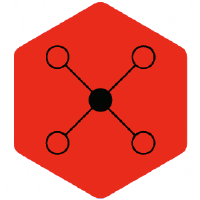

=========================================================
Welcome to UFCC's documentation!
=========================================================

**Last updated:** |today|

.. start-badges

|mdanalysis|
|actions|
|codecov|

.. |mdanalysis| image:: https://img.shields.io/badge/powered%20by-MDAnalysis-orange.svg?logoWidth=16&logo=data:image/x-icon;base64,AAABAAEAEBAAAAEAIAAoBAAAFgAAACgAAAAQAAAAIAAAAAEAIAAAAAAAAAAAAAAAAAAAAAAAAAAAAAAAAAAAAAAAAJD+XwCY/fEAkf3uAJf97wGT/a+HfHaoiIWE7n9/f+6Hh4fvgICAjwAAAAAAAAAAAAAAAAAAAAAAAAAAAAAAAACT/yYAlP//AJ///wCg//8JjvOchXly1oaGhv+Ghob/j4+P/39/f3IAAAAAAAAAAAAAAAAAAAAAAAAAAAAAAAAAAAAAAJH8aQCY/8wAkv2kfY+elJ6al/yVlZX7iIiI8H9/f7h/f38UAAAAAAAAAAAAAAAAAAAAAAAAAAB/f38egYF/noqAebF8gYaagnx3oFpUUtZpaWr/WFhY8zo6OmT///8BAAAAAAAAAAAAAAAAAAAAAAAAAAAAAAAAgICAn46Ojv+Hh4b/jouJ/4iGhfcAAADnAAAA/wAAAP8AAADIAAAAAwCj/zIAnf2VAJD/PAAAAAAAAAAAAAAAAICAgNGHh4f/gICA/4SEhP+Xl5f/AwMD/wAAAP8AAAD/AAAA/wAAAB8Aov9/ALr//wCS/Z0AAAAAAAAAAAAAAACBgYGOjo6O/4mJif+Pj4//iYmJ/wAAAOAAAAD+AAAA/wAAAP8AAABhAP7+FgCi/38Axf4fAAAAAAAAAAAAAAAAiIiID4GBgYKCgoKogoB+fYSEgZhgYGDZXl5e/m9vb/9ISEjpEBAQxw8AAFQAAAAAAAAANQAAADcAAAAAAAAAAAAAAAAAAAAAAAAAAAAAAAAAAAAAjo6Mb5iYmP+cnJz/jY2N95CQkO4pKSn/AAAA7gAAAP0AAAD7AAAAhgAAAAEAAAAAAAAAAACL/gsAkv2uAJX/QQAAAAB9fX3egoKC/4CAgP+NjY3/c3Nz+wAAAP8AAAD/AAAA/wAAAPUAAAAcAAAAAAAAAAAAnP4NAJL9rgCR/0YAAAAAfX19w4ODg/98fHz/i4uL/4qKivwAAAD/AAAA/wAAAP8AAAD1AAAAGwAAAAAAAAAAAAAAAAAAAAAAAAAAAAAAALGxsVyqqqr/mpqa/6mpqf9KSUn/AAAA5QAAAPkAAAD5AAAAhQAAAAEAAAAAAAAAAAAAAAAAAAAAAAAAAAAAADkUFBSuZ2dn/3V1df8uLi7bAAAATgBGfyQAAAA2AAAAMwAAAAAAAAAAAAAAAAAAAAAAAAAAAAAAAAAAAB0AAADoAAAA/wAAAP8AAAD/AAAAWgC3/2AAnv3eAJ/+dgAAAAAAAAAAAAAAAAAAAAAAAAAAAAAAAAAAAAAAAAA9AAAA/wAAAP8AAAD/AAAA/wAKDzEAnP3WAKn//wCS/OgAf/8MAAAAAAAAAAAAAAAAAAAAAAAAAAAAAAAAAAAAIQAAANwAAADtAAAA7QAAAMAAABUMAJn9gwCe/e0Aj/2LAP//AQAAAAAAAAAA
    :alt: Powered by MDAnalysis
    :target: https://www.mdanalysis.org

.. |actions| image:: https://github.com/ProLint/ufcc/workflows/CI/badge.svg
    :alt: GitHub Actions Build Status
    :target: https://github.com/ProLint/ufcc/actions?query=workflow%3ACI

.. |codecov| image:: https://codecov.io/gh/ProLint/UFCC/branch/master/graph/badge.svg
    :alt: codecov
    :target: https://codecov.io/gh/ProLint/UFCC/branch/master

.. end-badges

The **Ultra-Fast Contact Calculation (UFCC)** tool calculates the distance-based contacts from Molecular Dynamics (MD) simulations. 

Overview:
=========
**UFCC** derives several interactive plots for analysing lipid-protein interactions.
To suit the needs of your system, we offer flexible atom selection that will
enable you to use the most convenient `AtomGroups` to extract the contacts from your
MD simulations!

Basic example:
==============
.. code-block:: python

      # for serial contacts calculation
      from ufcc import UFCC

      target_system = UFCC('structure.gro', 'trajectory.xtc') 

      target_system.contacts.compute()
      target_system.contacts.count_contacts()

      
      # for parallel contacts calculation
      from ufcc import UFCC

      target_system = UFCC('structure.gro', 'trajectory.xtc') 
      target.contacts.runner.backend = 'parallel'
      
      target_system.contacts.compute()
      target_system.contacts.count_contacts()

You can find more details on how to use UFCC in the **TODO** (link to the Usage page).

.. Contents
.. ========

.. toctree::
   :maxdepth: 1
   :caption: Contents:
   
   source/intro.rst
   getting_started
   api
   source/contributing.rst

Indices and tables
==================

* :ref:`genindex`
* :ref:`modindex`
* :ref:`search`

License 
=======

Source code included in this project is available under the `MIT License`_ from `github.com/Prolint/ufcc`_.

Copyright
=========
Copyright (c) 2022, Daniel P. Ramirez & Besian I. Sejdiu

Acknowledgements
================ 
The respository structure of **UFCC** is based on the `Computational Molecular Science Python Cookiecutter <https://github.com/molssi/cookiecutter-cms>`__. version 1.6.

.. _`MIT License`: https://opensource.org/licenses/MIT
.. _`github.com/Prolint/ufcc`: https://github.com/ProLint/ufcc
