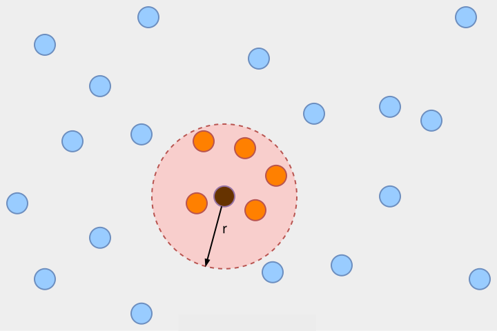
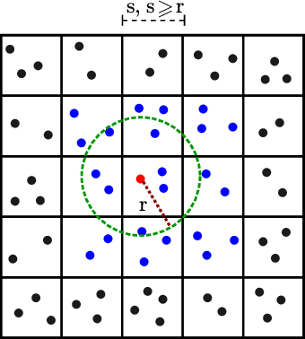

Overview
========
The fixed-radius near neighbors is an old computer science problem that can be defined in short as finding all pairs of points within a certain distance apart, as represented in the figure below.

|

There have been proposed different approaches to tackle this problem, mainly grouped into three categories: i-brute-force; ii-tree-based; and iii-grid-based methods, which are all useful in a certain 
range of conditions, especially determined by the way they scale with respect to the number of points in the system.

The brute-force approach computes the distances between all pairs of points in the dataset, which for **N** samples
in **D** dimensions, scales as :math:`\textbf{O}(\textbf{DN}^{2})`. This can useful for a small number of points, but it becomes very slow when you 
are working with a large **N**. 

The tree-based data structures attempt to reduce the required number of distance calculations by efficiently encoding aggregate distance information 
for the sample. The basic idea is that if point A is very distant from point B, and point B is very close to point C, then we know
that points A and C are very distant, *without having to explicitly calculate their distance*. In this way, the computational cost 
of a nearest neighbors search can be reduced to :math:`\textbf{O}(\textbf{DN}\log{(\textbf{N})})` or better.
The most common tree-based model for low-dimensional datasets (:math:`\textbf{D}<20`) 
is the KD-tree. A KD-tree is a binary tree structure that recursively partitions 
the parameter space along the data axes, dividing it into nested orthotropic regions into which data points are filed. The construction of a 
KD-tree is very fast because partitioning is performed only along the data axes, no D-dimensional distances need to be computed. Once constructed, 
the nearest neighbors of a query point can be determined with only :math:`O(log(\textbf{N}))`` distance computations. This is a significant improvement over brute-force for a large **N**, 
but it is still very slow when you are treating with a very large **N**. 

In the case of the grid-based methods, they divide the system into smaller subdomains called cells and distribute
every particle to these cells based on their positions. Subsequently, any distance-based query first
identifies the corresponding cell position in the domain followed by distance evaluations within
the identified cell and neighboring cells only (each cell has a size (:math:`s`) equal to or slightly larger than
the cutoff radius (:math:`r`); so each particle in a given cell interacts with only those particles in the same
or neighboring cells). Since the allocation of a particle to a cell is an operation that scales with **N**
and the total number of cells that needs to be considered for the calculation of the interaction is
independent of the system size (always 9 cells in a bidimensional space, or 27 for a tridimensional space), the cell list method
allows the computation of neighbors with a cost of :math:`O(\textbf{N})`, instead of :math:`O(\textbf{N}^2)`. Based on this, the
cell list algorithm is the most suitable approach to calculate the fixed radius neighbors in molecular dynamic systems, 
where you can usually deal with a very large number of points.

    
|

The current neighbors search implementation in the old version of **prolint** involves the brute-force computation of distances between 
all pairs of points in the dataset, which is very inefficient for lipid-protein systems with very high number of atoms. 
Furthermore, the old implementation only looked for the neighbors based in raw distances, whitout taking into account 
the periodic boundary conditions (PBC) present in most molecular dynamic simulations. Other limitations in the old
version of **prolint** included: i- high memory usage as it needs to load all the trajectory at once to run the calculation of the contacts;
ii- need to modify the trajectories previous to the setup of the Lipid and Protein groups for the calculation of the contacts; and
iii- core dependencies no longer mantained for the handling of the molecular dynamic trajectories (**MDTraj**).

How **prolint2** is able to solve the limitations of **prolintpy**?
-------------------------------------------------------------------

The major changes in **prolint2** compared to the old version that allow them to overpass the previously mentioned limitations are the migration
to the `MDAnalysis`_ ecosystem, the use of a **Cython** version of a cell list algorithm greatly inspired by the
neighbors grid search implemented in **GROMACS** (including the capacity to handle PBC), and the use of highly optimized data structures 
(**Scipy** matrices and **Pandas** dataframes) to store the contacts.

Features
--------

    #. Routine to calculate the distance-based contacts using a cell list fixed radius neighbors search algorithm. 

    #. It reads the frames of the trajectory completely *on-the-fly*, so it does not overload memory.

    #. It takes into account the PBC in both orthorhombic and triclinic types of simulation boxes.

    #. It automatically identifies the Protein and Lipid groups for the calculation of the contacts, so you do not need to make any previous cleaning steps in your system.

    #. User-friendly, easy-to-install and well-documented tool, based on the actively-maintained `MDAnalysis`_ package.

.. _MDAnalysis: https://www.mdanalysis.org
