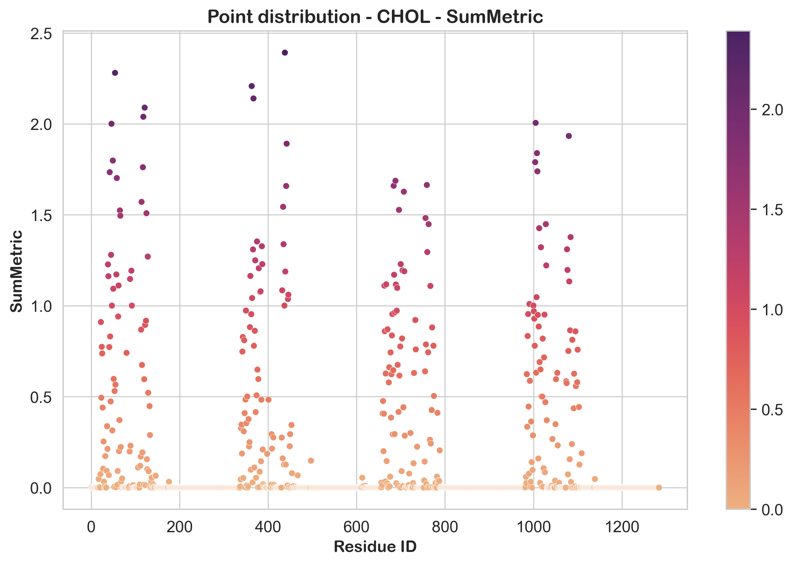

***********
Basic Usage
***********

This section will help you get started with **prolint2**, from loading the trajectory to basic analyses of the interactions. It is recommended to use **prolint2** within a `Jupyter notebook` environment for a more interactive and convenient experience. Here are the essential steps to complete the most basic workflow:

1. Import the **prolint2 Universe**:

In your Python environment, import the **ProLint2 Universe** class as:

.. code-block:: python

    from prolint2 import Universe

This class allows you to load your simulation data and get basic topological information of your system.

2. Load Your Data

Use the **ProLint2 Universe** class to load your simulation data, typically a GRO file for coordinates and an XTC file for trajectory. In this case, it will be used a sample data included in the library for a G protein-coupled inwardly rectifying potassium channel (GIRK).

Importing the GIRK sample data:

.. code-block:: python

    from prolint2.sampledata import GIRKDataSample
    GIRK = GIRKDataSample()

You can then load the trajectory data:

.. code-block:: python

    u = Universe(GIRK.coordinates, GIRK.trajectory)

Now, you have a **Universe** object **u** that you can use for further analysis.

3. Understand **Query** and **Database**

**prolint2** uses the concepts of **query** and **database** groups for defining the interactions. See previous section (:ref:`Workflow`) for more information on this.

You can access these groups using the *query* and *database* attributes. For example, we can access the number of atoms in each group as follows:

.. code-block:: python

    n_query_atoms = u.query.n_atoms
    n_database_atoms = u.database.n_atoms

    print(f'Number of query atoms: {n_query_atoms}')
    print(f'Number of database atoms: {n_database_atoms}')

This setup allows you to analyze interactions between the **query** and the **database** by initializing a **Contacts** object.

4. Compute **Contacts**

To compute contacts between the **query** and **database** groups, you can use the *compute_contacts* method. This method requires a cutoff distance in Angstroms for defining contacts:

.. code-block:: python

    contacts = u.compute_contacts(cutoff=7)

This step might take a few seconds, as it is calculating the interactions in every frame of the trajectory.

5. Define **Metrics**

Computing contact metrics is straightforward. You can create instances of various metrics, such as **MeanMetric**, and apply them to your contacts:

.. code-block:: python

    from prolint2.metrics.metrics import Metric, MeanMetric

    mean_instance = MeanMetric() # create an instance of the MeanMetric class
    metric_instance = Metric(contacts, mean_instance) # feed the contacts and the above instance to the Metric class
    mean_contacts = metric_instance.compute() # compute the metric

6. Using **Plotters** to visualize interactions

To visualize the interactions, you can use **prolint2**'s **Plotters**. Here is an example of how to create a Point Distribution plot:

.. code-block:: python

    from prolint2.plotting import PointDistribution
    
    PD = PointDistribution(u, mean_contacts, fig_size=(8, 5))
    PD.create_plot(lipid_type='CHOL', metric_name='MeanMetric', linewidth=0.24, palette='flare')

