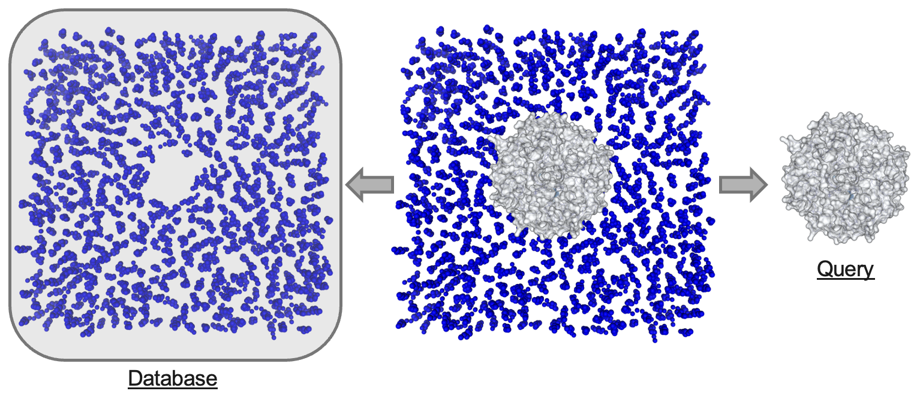
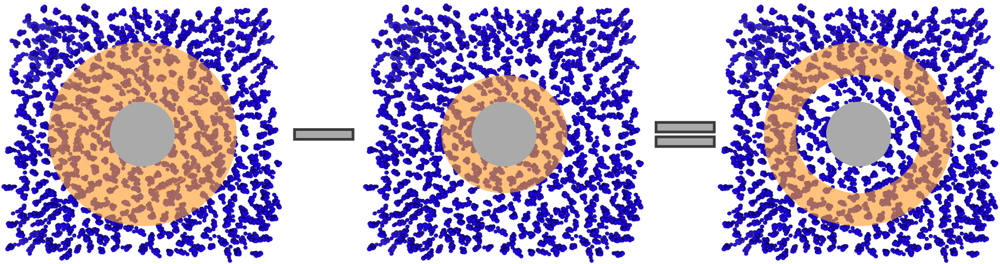
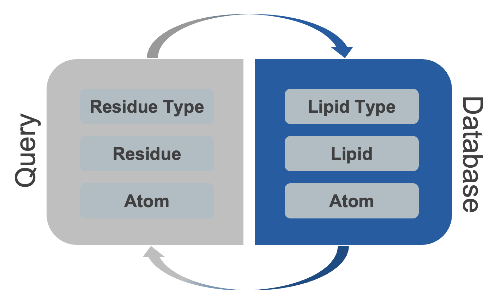

***********
Workflow
***********

The **prolint2** design is characterized by a sequential workflow that involves four main object types. Each object in the sequence depends on one or more of the previous objects, allowing you to accumulate information as you progress through the analysis. The figure below represents the object types and sequential workflow.

1. ProLint2 Universe: Building the Foundation
=============================================

The **ProLint2 Universe** is the starting point for your lipid-protein interaction analysis. The **ProLint2 Universe** is essentially an **MDAnalysis Universe** with additional methods and attributes tailored to the specific needs of ProLint2. This means you have access to all the methods and attributes available in a typical **MDAnalysis Universe**, and beyond. This compatibility ensures that you can use your existing knowledge of **MDAnalysis** while benefiting from **ProLint2**'s added functionality. It provides a robust foundation for accessing and handling your system's trajectory data. Whether you are loading sample datasets or your own custom data, the **ProLint2 Universe** simplifies the process and allows you to seamlessly transition to the next steps of your analysis.

In order to analyze lipid-protein interactions using **prolint2**, it is essential to know how the software identifies and distinguishes between the two primary components of your system. **prolint2** differentiates between the lipid component, referred to as the **database**, and the protein component, referred to as the **query**. This distinction is crucial to comprehending the subsequent analysis of the interactions.

When you load your trajectory data into **prolint2**, the software will automatically categorize the residues into one of these two groups. This categorization is primarily based on the residue name. Here is how it works:

* **Query**: Any residue with a name corresponding to an amino acid or a modified amino acid will be assigned to the query component.
* **Database**: Residues with names that match any of the lipid names in **prolint2**'s library will be automatically assigned to the database component.

This automated categorization simplifies your workflow significantly. You will not need to manually remove irrelevant residues, as **prolint2** will disregard any residues not assigned to either the **query** or the *database* components.

2. Contacts: Tracking Lipid-Protein Interactions
====================================================
Moving forward in the sequential flow, the subsequent step in building information about the interactions between lipids and protein residues is the **Contacts** class. This class is designed to store and organize information about the interactions on each frame, defining interactions where the distance between at least one atom on each group is less than a predefined cutoff. 

This class includes arithmetic operations that enable the creation of more complex contact schemas. For example, it can be used to analyze annular lipid distributions, when a shell of contacts with a larger cutoff is calculated, along with a core of contacts with a smaller cutoff. By subtracting/removing the core from the shell, a donut-shaped instance of contacts is formed, as represented in the figure below.

We have loaded our trajectory as a **Universe** and created a **contacts** instance to store all the contacts between the **query** and the **database**. Now, we need to make sense of the contacts by using various metrics and plots. To design these tools, we have considered a model that represents different levels of interactions between lipids and proteins, as shown in the diagram below.

**prolint2** offers insights into different aspects of lipid-protein interactions at varying levels of detail. Whether you want to determine which part of a protein residue is crucial for the interaction (backbone or sidechain), the importance of specific lipid components (headgroup or tails), or understand the most critical lipid types or specific lipid-protein interactions, **prolint2** can accommodate your analysis needs.

3. Metrics: Bridging the Gap
============================
While the **Universe** and **Contacts** objects provide access to information at the residue-residue and atom-atom levels, the residue-lipid type level information was still missing. This is where the **Metrics** objects come into play. Following the established sequential flow, **Metrics** objects are initialized from **Contacts** instances.

**prolint2** includes some default metrics for your convenience, including the **SumMetric**, **MaxMetric**, and **MeanMetric**. Let's clarify the differences between these metrics:

* **SumMetric**: This metric calculates the total number of interactions with the same lipid type and normalizes it over the entire trajectory, providing insights into the cumulative interaction strength.
* **MaxMetric**: The **MaxMetric** identifies the maximum duration of interactions with the same lipid type, providing insights into the longest-lasting interactions normalized over the total number of frames.
* **MeanMetric**: The **MeanMetric** computes the average duration of interactions with the same lipid type and normalizes it over the entire trajectory, offering a balanced view of interaction duration.

In addition to that, we also offer the opportunity to define new custom metrics by importing the **UserDefinedMetric** class. This flexibility allows you to tailor your interaction analysis to your specific research needs. Whether you are interested in using default metrics or developing custom ones, **prolint2** makes it easy to extract meaningful insights at this interaction level.

4. Plotters
===========

The visualization tools, referred to as **Plotters**, are designed to provide a structured and logical approach to understanding the interactions within your system. When you begin analyzing your data, it's helpful to start with exploratory **Plotters**. These tools are designed to identify the most relevant interactions within your system. By using them, you can get an overview of the interactions between the proteins and lipids. As you continue analyzing your data, you can delve deeper into the details of each interaction, down to the residue-lipid and atom-atom levels. This systematic approach will streamline your analysis and ensure that you uncover all relevant insights from your lipid-protein interaction data, in alignment with the interaction levels described earlier.